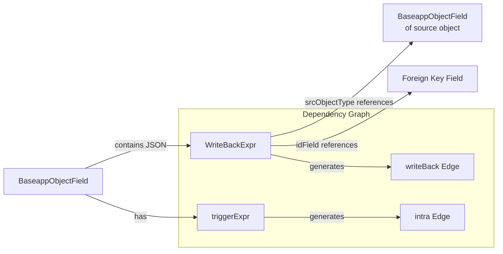

# Data Model: 本地化表达式解析引擎

**Date**: 2026-05-05

## Entities

### WriteBackExpr (已有, 需增强解析)

回写表达式元数据模型，存储在 `baseapp_object_field.write_back_expr` JSON 列中。

| Field | Type | Description | Currently Parsed |
|-------|------|-------------|:---:|
| srcObjectType | String | 回写源对象类型名 | ✅ |
| idField | String | 源对象中指向目标对象的外键字段路径 | ❌ → 需增加 |
| expression | String | 聚合表达式 (如 `sum(amount)`) | ✅ |
| condition | String | 过滤条件 (如 `isDeleted=false`) | ✅ |
| executingMoment | String | 回写时机配置 (如 `ALWAYS`, JSON 格式) | ❌ → 需增加 |
| validateExpr | String | 回写后校验表达式 | ❌ → 需增加 |
| validateMessage | String | 校验失败时的提示信息 | ❌ → 需增加 |

### BaseappObjectField (已有, 无需修改)

字段元数据模型，从 `baseapp_object_field` 表加载。

| Field | Type | Description |
|-------|------|-------------|
| id | String | 字段 ID |
| objectType | String | 所属对象类型 |
| name | String | 物理/原始字段名 |
| apiName | String | API 规范名 (驼峰) |
| title | String | 字段中文名 |
| type | String | 字段类型 |
| expression | String | 公式表达式 |
| triggerExpr | String | 触发表达式 |
| virtualExpr | String | 虚拟表达式 |
| writeBackExpr | String | 回写表达式 (JSON 字符串) |
| referInfo | String | 外键引用信息 (JSON 字符串) |
| refObjectType | String | 引用对象类型 |

### ExpressionEngineConfig (新增)

Feature Flag 配置类。

| Property | Type | Default | Description |
|----------|------|---------|-------------|
| expression-engine.local-writeback-sql | boolean | false | 是否使用本地回写 SQL 生成（true=本地, false=HTTP） |

## Relationships



## Key Data Flows

### 1. 回写 SQL 生成 (当前: HTTP)

```
UpgradeScriptService.appendWriteBackSql()
  → callWriteBackSqlApi(fieldPath)
    → OkHttp POST to arap.{env}/arap/gen/debug/writeBackField2sql
      → 返回 UPDATE SQL 字符串
```

### 2. 回写 SQL 生成 (目标: 本地)

```
UpgradeScriptService.appendWriteBackSql()
  → [Feature Flag check]
  → WriteBackSqlGenerator.generateSql(objectType, field, writeBackExpr)
    → 解析 writeBackExpr (srcObjectType, idField, expression, condition)
    → 组装: UPDATE {targetTable} SET {field} = (SELECT {expression} FROM {srcTable} WHERE {idField}=m.id AND isDeleted=false {condition})
    → 转换: objectName→tableName, camelField→snake_column
    → 返回 PostgreSQL UPDATE SQL
```

### 3. 依赖图谱 writeBack 边构建 (已有, 增强 executingMoment)

```
ImpactAnalyzerService.buildGraph()
  → parseWriteBack(writeBackExprJson)
    → 提取 srcObjectType, expression, condition
    → [增强] 提取 idField, executingMoment
  → ExprUtils.extractCamelFieldsFromSql(expression)
  → 建立 writeBack 边: srcObject.srcField → targetObject.targetField
  → [增强] 边属性中附加 executingMoment 信息
```
