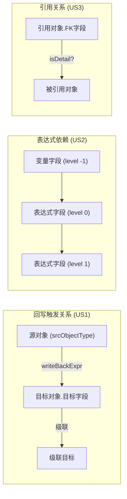

# Data Model: 元数据服务能力提取

## 现有模型（不修改）

### BaseappObjectField
已有字段，本次直接复用：
- `objectType` — 所属对象类型
- `name` — 字段物理名
- `expression` — 计算表达式
- `triggerExpr` — 触发表达式
- `writeBackExpr` — 回写表达式（JSON 字符串）
- `referInfo` — 引用关系（JSON 字符串）
- `type` — 字段类型（STRING/LIST/NUMBER 等）

### WriteBackExpr（已有模型）
- `srcObjectType` — 回写源对象
- `expression` — 聚合表达式
- `idField` — 关联字段
- `condition` — 过滤条件
- `executingMoment` — 执行时机

## 新增模型

### WriteBackRelationInfo
回写触发关系索引项。

| 字段 | 类型 | 说明 |
|------|------|------|
| srcObjectType | String | 源对象（触发回写的对象） |
| targetObjectType | String | 目标对象（被回写的对象） |
| targetFieldName | String | 目标字段名 |
| expression | String | 聚合表达式（sum/count 等） |
| idField | String | 关联字段路径 |
| condition | String | 回写条件（可选） |
| sourceVars | Set\<String\> | 表达式+条件中涉及的源对象变量字段 |

### CascadeWriteBackInfo
级联回写信息——当目标字段本身也被其他对象回写时。

| 字段 | 类型 | 说明 |
|------|------|------|
| srcObjectType | String | 源对象 |
| targetObjectType | String | 中间目标对象 |
| targetFieldName | String | 中间目标字段 |
| cascadeTargetObjectType | String | 最终目标对象 |
| cascadeTargetFieldName | String | 最终目标字段 |

### ExpressionFieldInfo
表达式字段依赖视图——单个对象内的计算依赖。

| 字段 | 类型 | 说明 |
|------|------|------|
| objectType | String | 所属主对象 |
| exprFieldToVars | Map\<String, Set\<String\>\> | 表达式字段 → 变量字段集合 |
| noVarExprFields | Set\<String\> | 无变量的表达式字段 |
| fieldToExprFields | Map\<String, Set\<String\>\> | 变量字段 → 引用该变量的表达式字段 |
| levelToFields | Map\<Integer, Set\<String\>\> | 层级 → 字段集合（-1=变量, 0=最先计算, N=依赖 N-1） |

### EntityReferenceIndex
对象引用关系反向索引。

| 字段 | 类型 | 说明 |
|------|------|------|
| referredEntity | String | 被引用的对象 |
| referringEntity | String | 引用方对象 |
| fkFieldName | String | FK 字段名 |
| isDetail | boolean | 是否为子表（Detail）关系 |

**全量索引结构**: `Map<被引用对象, Map<引用对象, Map<FK字段, Boolean(isDetail)>>>`，其中 key "ALL" 表示多态引用。

## 数据库查询扩展

### 新增 Mapper 方法

#### selectSourceInfoFields
查询所有 LIST 类型字段的 source_info（用于识别子表关系和合并子表表达式到主表）。

```sql
SELECT f.object_type, f.name, f.source_info::text as source_info
FROM baseapp_object_field f
WHERE f.type = 'LIST'
  AND f.source_info IS NOT NULL
```

#### selectDetailRelations
查询所有 isDetail=true 的引用关系（用于对象引用反向索引）。

```sql
SELECT f.object_type, f.name, f.refer_info::text as refer_info
FROM baseapp_object_field f
WHERE f.refer_info IS NOT NULL
  AND f.refer_info::text != 'null'
```

## 关系图


