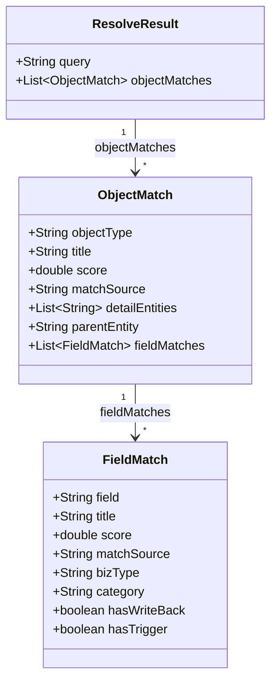

# Data Model: Agent 自然语言元数据匹配

## 请求模型

### ResolveRequest

| 字段 | 类型 | 必填 | 说明 |
|------|------|------|------|
| query | String | ✅ | 用户输入的自然语言文本 |
| maxResults | int | ❌ | 最多返回的对象匹配数，默认 5 |
| includeFields | boolean | ❌ | 是否同时匹配字段，默认 true |

## 响应模型

### ResolveResult

| 字段 | 类型 | 说明 |
|------|------|------|
| query | String | 原始输入文本 |
| objectMatches | List\<ObjectMatch\> | 对象匹配列表，按置信度降序 |

### ObjectMatch

| 字段 | 类型 | 说明 |
|------|------|------|
| objectType | String | 对象技术名（PascalCase） |
| title | String | 中文标题 |
| score | double | 置信度评分（0.0~1.0） |
| matchSource | String | 匹配来源：EXACT_NAME / SYNONYM / TITLE_EXACT / TITLE_CONTAINS |
| detailEntities | List\<String\> | 子表对象列表（仅主表有值） |
| parentEntity | String | 主表对象名（仅子表有值） |
| fieldMatches | List\<FieldMatch\> | 嵌套的字段匹配列表 |

### FieldMatch

| 字段 | 类型 | 说明 |
|------|------|------|
| field | String | 字段技术名（camelCase） |
| title | String | 中文标题 |
| score | double | 置信度评分 |
| matchSource | String | 匹配来源 |
| bizType | String | 业务类型（Amount / Qty / ...） |
| category | String | 字段分类：AMOUNT / QTY / WRITE_BACK / TRIGGER / VIRTUAL / BASE |
| hasWriteBack | boolean | 是否有回写表达式 |
| hasTrigger | boolean | 是否有触发表达式 |

## 关系图

