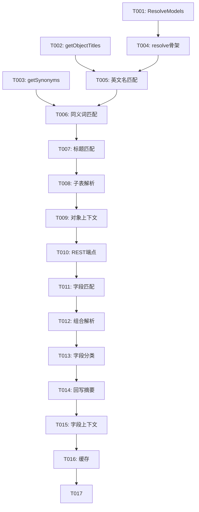

# Tasks: Agent 自然语言元数据匹配

**Feature Branch**: `004-agent-metadata-matching`
**Spec**: [spec.md](file:///Users/pengfyu/advance/deepModel/specs/004-agent-metadata-matching/spec.md)
**Plan**: [plan.md](file:///Users/pengfyu/advance/deepModel/specs/004-agent-metadata-matching/plan.md)

## Task Legend

- **[P]**: Can run in parallel (different files, no dependencies)
- **[Story]**: Which user story this task belongs to (US1, US2, US3)
- Include exact file paths in descriptions

---

## Phase 1: Setup

**Purpose**: 新增模型类，为匹配服务提供数据结构

- [ ] T001 [P] 新增 `ResolveModels.java` 模型文件，包含 ResolveResult、ObjectMatch、FieldMatch、MatchSource 枚举 `src/main/java/com/deepmodel/relation/model/ResolveModels.java`

---

## Phase 2: Foundational

**Purpose**: 构建对象名匹配的核心索引（反向映射表），供后续 US1/US2 共用

- [ ] T002 在 `ImpactAnalyzerService` 中新增 `getObjectTitles()` 公开方法暴露 objectTitles 映射 `src/main/java/com/deepmodel/relation/service/ImpactAnalyzerService.java`
- [ ] T003 在 `ImpactAnalyzerService` 中新增 `getGlobalSynonyms()` 公开方法暴露 GLOBAL_SYNONYMS 映射 `src/main/java/com/deepmodel/relation/service/ImpactAnalyzerService.java`

**Verification**: T002/T003 可通过调用 getter 验证返回非空 Map

---

## Phase 3: US1 — 自然语言解析对象名称 (P1)

**Story Goal**: 用户输入中文业务术语，系统匹配到准确的元数据对象

**Independent Test**: 调用 `/api/skills/resolve?query=应收合同` 返回 ArContract 作为最佳匹配

- [ ] T004 [US1] 在 `SkillsService` 中新增 `resolve(String query, int maxResults, boolean includeFields)` 方法骨架 `src/main/java/com/deepmodel/relation/service/SkillsService.java`
- [ ] T005 [US1] 实现对象匹配逻辑：精确英文名匹配（score=1.0） `src/main/java/com/deepmodel/relation/service/SkillsService.java`
- [ ] T006 [US1] 实现对象匹配逻辑：GLOBAL_SYNONYMS 同义词匹配（score=0.9） `src/main/java/com/deepmodel/relation/service/SkillsService.java`
- [ ] T007 [US1] 实现对象匹配逻辑：objectTitles 中文标题精确匹配（score=0.8）和包含匹配（score=0.6） `src/main/java/com/deepmodel/relation/service/SkillsService.java`
- [ ] T008 [US1] 实现"XX的子表"语义解析：检测关键词（子表/明细/行项目），通过 mainToDetails 返回子表列表 `src/main/java/com/deepmodel/relation/service/SkillsService.java`
- [ ] T009 [US1] 为 ObjectMatch 填充上下文信息：detailEntities、parentEntity `src/main/java/com/deepmodel/relation/service/SkillsService.java`
- [ ] T010 [US1] 在 `SkillsController` 中新增 `/api/skills/resolve` GET 端点 `src/main/java/com/deepmodel/relation/controller/SkillsController.java`

**Verification**: `curl "http://localhost:18080/api/skills/resolve?query=应收合同"` 返回 ArContract，score=0.9

---

## Phase 4: US2 — 自然语言解析字段名称 (P1)

**Story Goal**: 用户输入中文字段描述，系统匹配到准确的对象+字段组合

**Independent Test**: 调用 `/api/skills/resolve?query=应收合同的原始金额` 返回 ArContract.originAmount

**Depends on**: Phase 3（对象匹配逻辑作为字段匹配的前置步骤）

- [ ] T011 [US2] 在 resolve() 中实现字段匹配逻辑：从匹配到的对象中搜索字段（标题精确匹配 score=0.8，包含匹配 score=0.6） `src/main/java/com/deepmodel/relation/service/SkillsService.java`
- [ ] T012 [US2] 实现"对象+字段"组合解析：从输入文本中提取对象部分和字段部分（如"应收合同的原始金额" → 对象="应收合同", 字段="原始金额"） `src/main/java/com/deepmodel/relation/service/SkillsService.java`
- [ ] T013 [US2] 为 FieldMatch 填充字段分类信息（category: AMOUNT/QTY/WRITE_BACK/TRIGGER/VIRTUAL/BASE），复用已有的 isAmountField/isQtyField 等方法 `src/main/java/com/deepmodel/relation/service/SkillsService.java`

**Verification**: `curl "http://localhost:18080/api/skills/resolve?query=应收合同的原始金额"` 返回 ArContract 下嵌套 originAmount

---

## Phase 5: US3 — 匹配结果附带上下文信息 (P2)

**Story Goal**: 匹配结果包含业务上下文（回写关系、字段分类等）

**Independent Test**: 匹配结果中包含 detailEntities 列表和字段的 hasWriteBack/hasTrigger 标记

**Depends on**: Phase 3 + Phase 4

- [ ] T014 [US3] 为 ObjectMatch 补充入站/出站回写关系摘要信息 `src/main/java/com/deepmodel/relation/service/SkillsService.java`
- [ ] T015 [US3] 为 FieldMatch 补充 hasWriteBack、hasTrigger、bizType 等上下文字段 `src/main/java/com/deepmodel/relation/service/SkillsService.java`

**Verification**: 返回结果中 fieldMatches 的 hasWriteBack/hasTrigger/bizType 字段不为空

---

## Phase 6: Polish & Cross-Cutting

**Purpose**: 缓存、测试和端到端验证

- [ ] T016 为 resolve() 方法添加 Guava Cache 缓存（与其他 Skills 缓存统一管理） `src/main/java/com/deepmodel/relation/service/SkillsService.java`
- [ ] T017 新增 `SkillsServiceResolveTest.java` 单元测试，覆盖精确英文名、同义词、中文标题、子表解析、空输入等场景 `src/test/java/com/deepmodel/relation/service/SkillsServiceResolveTest.java`

---

## Dependencies

## Parallel Execution

| 并行组 | 可同时执行的任务 |
|--------|-----------------|
| Setup | T001 + T002 + T003（不同文件，无依赖） |

## Implementation Strategy

**MVP Scope**: Phase 1~3（对象匹配），实现后即可验证核心价值。

**增量交付**:
1. Phase 1-3 → MVP：对象名匹配可用
2. Phase 4 → 字段匹配：对象+字段组合解析
3. Phase 5-6 → 完善：上下文信息、缓存、测试
