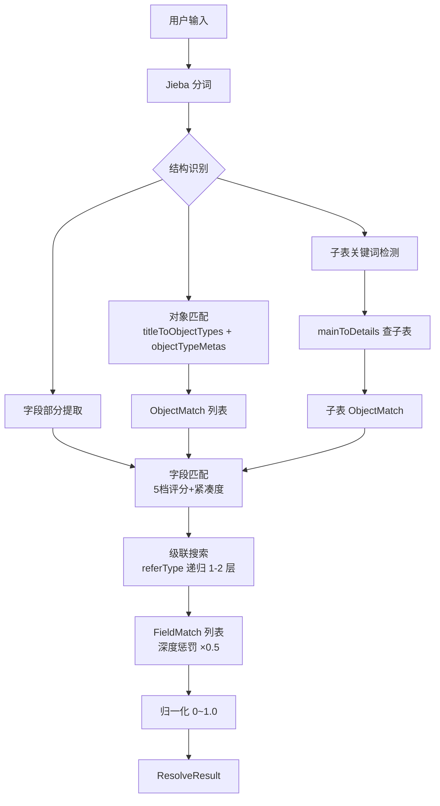

# Data Model: 增强自然语言元数据匹配

## 实体变更

### BaseappObjectField（扩展）

| 字段 | 类型 | 来源 | 说明 |
|------|------|------|------|
| description | String | f.description | 字段描述文本 |
| enumType | String | f.enum_type | 枚举类型名（如 ApproveStatus） |
| isDisabled | Boolean | f.is_disabled | 是否停用 |
| isMasterField | Boolean | f.is_master_field | 是否主字段（级联搜索加分用） |

### ObjectTypeMeta（新增）

| 字段 | 类型 | 来源 | 说明 |
|------|------|------|------|
| name | String | baseapp_object_type.name | 对象类型名（如 ArContract） |
| title | String | baseapp_object_type.title | 中文标题（如 应收合同） |
| description | String | baseapp_object_type.description | 对象描述 |
| type | String | baseapp_object_type.type | 类型（bill/document/setting） |
| isDisabled | Boolean | baseapp_object_type.is_disabled | 是否停用 |

### FieldMatch（扩展 ResolveModels 内部类）

| 字段 | 类型 | 新增/修改 | 说明 |
|------|------|----------|------|
| description | String | 新增 | 字段描述 |
| enumType | String | 新增 | 枚举类型名 |
| isDisabled | Boolean | 新增 | 是否停用 |

### ObjectMatch（扩展 ResolveModels 内部类）

| 字段 | 类型 | 新增/修改 | 说明 |
|------|------|----------|------|
| description | String | 新增 | 对象描述 |
| type | String | 新增 | 对象类型（bill/document/setting） |
| isDisabled | Boolean | 新增 | 是否停用 |

## 索引变更

### ImpactAnalyzerService 新增内存索引

| 索引 | 类型 | 构建时机 | 用途 |
|------|------|---------|------|
| objectTypeMetas | `Map<String, ObjectTypeMeta>` | reload() | 替代 objectTitles，包含完整对象元信息 |
| titleToObjectTypes | `Map<String, List<String>>` | reload() 末尾 | 中文标题 → 对象名反向索引（自动同义词） |

### SQL 变更

**selectAll** 新增列：`f.description, f.enum_type, f.is_disabled, f.is_master_field`

**selectObjectTitles** 改为：`select name, title, type, description, is_disabled from baseapp_object_type`

## 关系图

